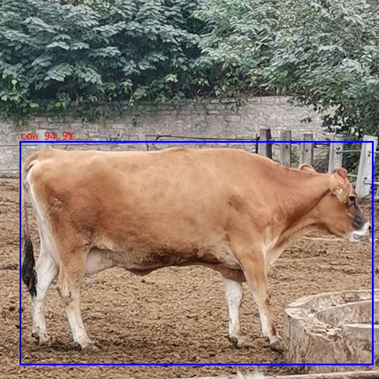
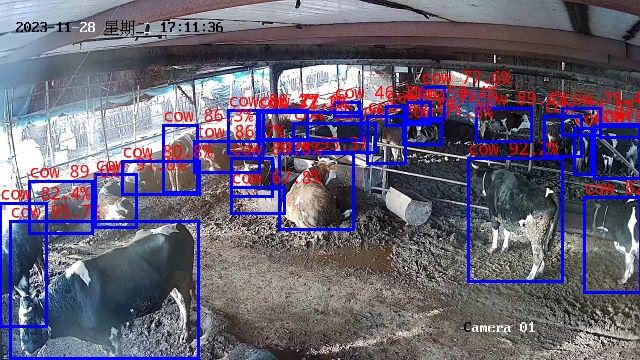

# ReadMe

## Abstract:

This is a full process to deploy yolov5 on rv1126

(or rv1109,similar with rv1106 and rv1103).

In this project,the sequence is:

1.Train model

2.Detect pt model

3.Export onnx model

4.Convert onnx to rknn

5.Link board using rknn detect object

6.Accuracy analysis

7.Compile model

8.Deploy model

9.Test in real-world situations


## 1.Train model

In **rk_yolov5_master**

```shell
python train.py --img 640 --epoch 500 --weights yolov5s.pt --data data/my.yaml 
```


## 2.Detect pt model

In **rk_yolov5_master**

```shell
python detect.py --weights your_trained_model.pt --source your_img.jpg
```


## 3.Export onnx model

In **rk_yolov5_master**

```shell
# for detection model
python export.py --rknpu --weight yolov5s.pt

# for segmentation model
python export.py --rknpu --weight yolov5s-seg.pt
```


## 4.Convert onnx to rknn

in **rkzoo_example_yolov5**

*Usage:*

```shell
cd python
python convert.py <onnx_model> <TARGET_PLATFORM> <dtype(optional)> <output_rknn_path(optional)>

# such as: 
python convert.py ../model/yolov5s_relu.onnx rk3588
# output model will be saved as ../model/yolov5.rknn
```

*Description:*

- `<onnx_model>`: Specify ONNX model path.
- `<TARGET_PLATFORM>`: Specify NPU platform name. Support Platform refer [here](#2-current-support-platform).
- `<dtype>(optional)`: Specify as `i8` or `fp`. `i8` for doing quantization, `fp` for no quantization. Default is `i8`.
- `<output_rknn_path>(optional)`: Specify save path for the RKNN model, default save in the same directory as ONNX model with name `yolov5.rknn`


## 5.Link board to detect object

in **rkzoo_example_yolov5**

*Usage:*

```shell
cd python
# Inference with PyTorch model or ONNX model
python yolov5.py --model_path <pt_model/onnx_model> --img_show

# Inference with RKNN model
python yolov5.py --model_path <rknn_model> --target <TARGET_PLATFORM> --img_show
```

*Description:*

- `<TARGET_PLATFORM>`: Specify NPU platform name. Such as 'rk3588'.
- `<pt_model / onnx_model / rknn_model>`: specified as the model path.


## 6.Accuracy analysis

In **accuracy_analysis**

```shell
python my_normal_quantizition.py
```

The accuracy log's meaning in README.md,you should watching it.


## 7.Compile model

in **rkzoo_example_yolov5**

tip:Need full rknn_model_zoo package.Please read https://github.com/airockchip/rknn_model_zoo/blob/main/examples/yolov5/README.md

*usage*

```shell
# go back to the rknn_model_zoo root directory
cd ../../

# if GCC_COMPILER not found while building, please set GCC_COMPILER path
(optional)export GCC_COMPILER=<GCC_COMPILER_PATH>

./build-linux.sh -t <TARGET_PLATFORM> -a <ARCH> -d yolov5

# such as 
./build-linux.sh -t rk3588 -a aarch64 -d yolov5
# such as 
./build-linux.sh -t rv1106 -a armhf -d yolov5
```

*Description:*

- `<GCC_COMPILER_PATH>`: Specified as GCC_COMPILER path.

  - For RV1106, RV1103, GCC_COMPILER version is `arm-rockchip830-linux-uclibcgnueabihf`

    ```sh
    export GCC_COMPILER=~/opt/arm-rockchip830-linux-uclibcgnueabihf/bin/arm-rockchip830-linux-uclibcgnueabihf
    ```

- `<TARGET_PLATFORM>` : Specify NPU platform name. Support Platform refer [here](#2-current-support-platform).

- `<ARCH>`: Specify device system architecture. To query device architecture, refer to the following command: 

  ```shell
  # Query architecture. For Linux, ['aarch64' or 'armhf'] should shown in log.
  adb shell cat /proc/version
  ```


## 8.Deploy model

result folder:rknn_yolov5_demo

tip:Need full rknn_model_zoo package.Please read https://github.com/airockchip/rknn_model_zoo/blob/main/examples/yolov5/README.md

- If device connected via USB port, push demo files to devices:

```shell
adb push install/<TARGET_PLATFORM>_linux_<ARCH>/rknn_yolov5_demo/ /userdata/
```

- For other boards, use `scp` or other approaches to push all files under `install/<TARGET_PLATFORM>_linux_<ARCH>/rknn_yolov5_demo/` to `userdata`.

```shell
./rknn_yolov5_demo model/yolov5.rknn model/bus.jpg
```

After running, the result was saved as `out.png`. To check the result on host PC, pull back result referring to the following command: 

```
adb pull /userdata/rknn_yolov5_demo/out.png
```


## 9.Test in real-world situations

In field_tests there have two folders: **myvideo** and **yolov5_jpeg**

myvideo for record video,video format can be nv12,h264,h264 and mjpg

yolov5_jpeg for take a picture and detect it.Use **ispserver** module can avoid taking iqfiles in starting parameter.

# On rv1126 board forward process result

cow1_out.jpg




cow3_out.jpg




# tested in real-world situations result


# Done!

