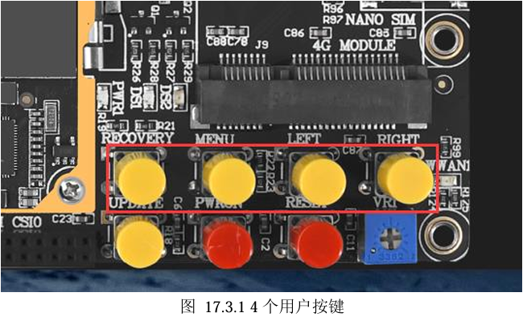

# ReadMe

# Abstract

For ATK-DLRV1126,i made a C app easy to take pictures,no more PC linked with board, just startup and put the button and picture will be automatically taking.

# Files Describe

**S99ispserver**

For rockchip ipsserver startup,please put this file into /etc/init.d/.

**S99test**

Press the button to capture pictures,please put this file into /etc/init.d/.If your **rkmedia_venc_jpeg_test** is not in /root/ address,please modify this file and notice C app startup address!

**rkmedia_venc_jpeg_test**

C app,put this into /root/.

**rkmedia_venc_jpeg_test.c**

Source file.

# Usecase

There is buttons:

There are four button you can use,each can taking a picture into /demo/my_imgs/,picture named in 0,1,2,...,N.jpeg

tip:input enevts source from **/dev/input/event1**.

# Enjoy!